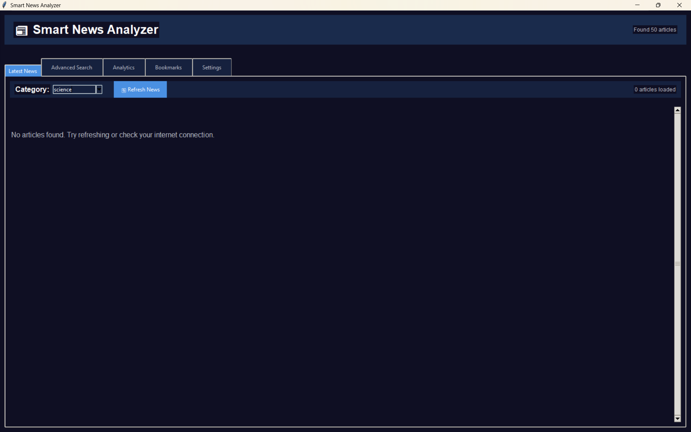
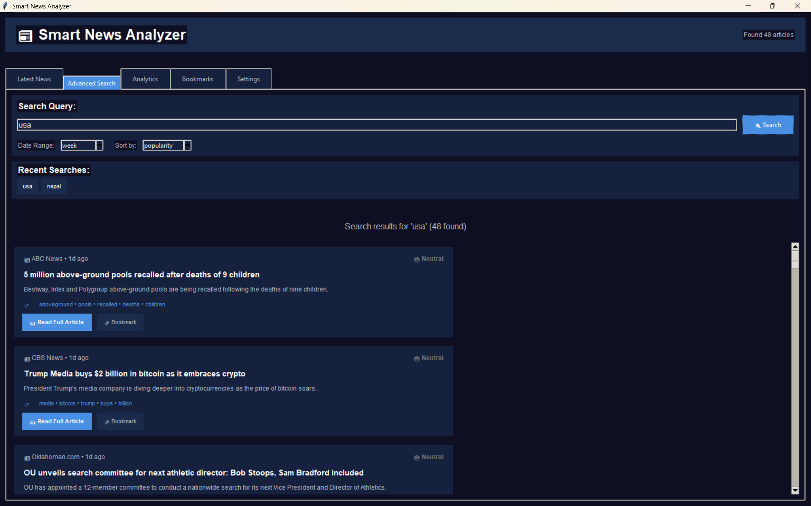

# 📰 News Scraper

A Python-based tool that scrapes real-time news articles from various websites using BeautifulSoup and Requests. This lightweight application collects headlines, summaries, and links for the latest news based on user-defined topics.

---
This is the sample screenshot of this news scraper




## 🚀 Features

- 🌐 **Multi-site News Scraping** – Extracts articles from major news sources.
- 🔍 **Keyword-based Filtering** – Search and collect articles based on specific topics.
- 🧠 **Sentiment Analysis** *(Optional)* – Basic sentiment analysis using `TextBlob`.
- 💾 **Data Export** – Save scraped data in CSV or JSON format.
- 🕒 **Scheduled Scraping** – Automate scraping with Cron or Task Scheduler.
- 🖥️ **Minimal GUI** *(Optional)* – Simple interface using Tkinter or Flask (if implemented).

---

## 🛠️ Technologies Used

| Component       | Technology         |
|----------------|--------------------|
| Language        | Python 3.x         |
| Scraping        | BeautifulSoup, Requests |
| Parsing         | lxml / html.parser |
| Storage         | CSV / JSON         |
| Sentiment (opt) | TextBlob / NLTK    |
| UI (opt)        | Tkinter / Flask    |

---

## 📂 Project Structure

news-scraper/
│
├── scraper.py # Main scraping logic
├── config.py # Configurable URLs and keywords
├── sentiment.py # Sentiment analysis module (optional)
├── utils.py # Helper functions
├── requirements.txt # Python dependencies
├── README.md # Project documentation
└── output/
├── news_data.csv # Scraped news data (CSV format)
└── news_data.json # Scraped news data (JSON format)


---

## ⚙️ Installation

1. **Clone the repository**
```bash
git clone https://github.com/Chirag037/News-Scraper.git
cd News-Scraper
